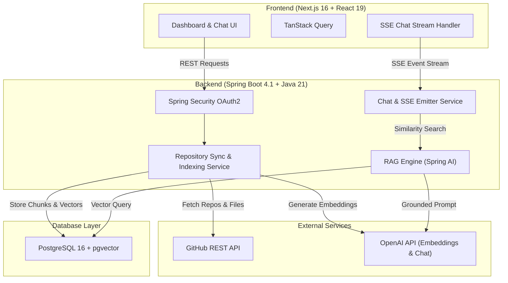

# Github Repository AI Chatbot 🚀

> **AI-Powered GitHub Repository Assistant & Interactive Codebase Chatbot**

`devPilot` is a full-stack developer assistant that connects to your GitHub repositories, indexes codebase contents into a vector database using **Retrieval-Augmented Generation (RAG)**, and allows interactive chat with grounded, precise code citations.

---

## 🌟 Key Features

- 🔐 **GitHub OAuth2 Authentication**: Secure login via GitHub OAuth with token encryption (AES) and session cookie handling.
- 🔄 **Repository Synchronization**: Automatically sync public and private GitHub repositories with rate-limiting protection.
- ⚡ **Vector-Based Code Indexing**: Token-aware code chunking (`TokenTextSplitter`) and vector storage via **Spring AI** and **pgvector**.
- 💬 **Streaming Codebase Chat**: Real-time response streaming powered by Server-Sent Events (SSE) and OpenAI LLMs.
- 🎯 **Precise File Citations**: Every answer includes explicit citations back to source files and line ranges.
- 📊 **Modern Developer Dashboard**: Clean, responsive UI built with Next.js 16, React 19, Tailwind CSS, and shadcn/ui.
- 🌓 **Dark & Light Mode**: Built-in theme switching support.

---

## 🏗️ System Architecture



---

## 🛠️ Technology Stack

### **Backend**
* **Language/SDK**: Java 21
* **Framework**: Spring Boot 4.1.0 (Spring WebMVC, Spring Data JPA, Spring Security OAuth2, Actuator)
* **AI Framework**: Spring AI 2.0.0 (`spring-ai-starter-model-openai`, `spring-ai-starter-vector-store-pgvector`)
* **Build System**: Maven (via `mvnw`)
* **Utilities**: Lombok, Jakarta Validation

### **Frontend**
* **Framework**: Next.js 16.2 (App Router), React 19, TypeScript 5
* **Styling**: Tailwind CSS v4, shadcn/ui, Lucide React, `next-themes`
* **State & Fetching**: `@tanstack/react-query`, native `fetch`
* **Markdown & Streaming**: `streamdown`, `@streamdown/code`

### **Database & Infrastructure**
* **Database**: PostgreSQL 16 with `pgvector`, `hstore`, and `uuid-ossp` extensions
* **Containerization**: Docker Compose (`pgvector/pgvector:pg16`)

---

## 📁 Project Structure

```
devPilot/
├── backend/                        # Spring Boot backend application
│   ├── pom.xml                     # Maven configuration & dependencies
│   └── src/
│       ├── main/java/devPilot/backend/
│       │   ├── config/             # Security, CORS, Async & Crypto configurations
│       │   ├── controllers/        # Auth, Repo, and Chat REST endpoints
│       │   ├── dto/                # Request & Response Data Transfer Objects
│       │   ├── entity/             # JPA Entities (User, Repository, ChatSession, ChatMessage)
│       │   ├── exceptions/         # Global exception handling
│       │   ├── repository/         # Spring Data JPA repositories
│       │   ├── security/           # GitHub OAuth2 user service & principal mapping
│       │   └── services/           # Business logic
│       │       ├── ai/             # RAG retrieval, prompt builder, stream handler, citations
│       │       ├── github/         # GitHub API client & rate limiter
│       │       └── indexing/       # File filtering, code chunking, background indexing
│       └── test/                   # Backend unit and integration tests
├── client/                         # Next.js frontend application
│   ├── app/                        # Next.js App Router (login, dashboard, chat, auth callback)
│   ├── components/                 # UI components (chat, dashboard, layout, shadcn/ui)
│   ├── hooks/                      # Custom React hooks
│   ├── lib/                        # API client, utilities, and query keys
│   └── package.json                # Frontend dependencies & scripts
├── docker/
│   └── postgres/
│       └── init-extensions.sql     # PostgreSQL extension initialization (vector, hstore, uuid)
├── docker-compose.yml              # Local PostgreSQL + pgvector container definition
└── README.md                       # Project documentation
```

---

## 📋 Prerequisites

Ensure you have the following installed on your machine:

- **Java JDK 21** or higher
- **Node.js 18.x** or higher (with `npm` or `pnpm`)
- **Docker** & **Docker Compose**
- **OpenAI API Key** (for embeddings and chat completions)
- **GitHub OAuth App Credentials** (Client ID & Client Secret)

---

## ⚙️ Environment & Configuration

Create or configure your environment properties for the Spring Boot backend (`backend/src/main/resources/application.properties`):

```properties
server.port=8080

# Database Configuration (PostgreSQL + pgvector)
spring.datasource.url=jdbc:postgresql://localhost:5433/devpilot
spring.datasource.username=postgres
spring.datasource.password=postgres
spring.jpa.hibernate.ddl-auto=update
spring.jpa.properties.hibernate.dialect=org.hibernate.dialect.PostgreSQLDialect

# Spring AI & OpenAI Configuration
spring.ai.openai.api-key=${OPENAI_API_KEY}
spring.ai.openai.chat.options.model=gpt-4o-mini
spring.ai.openai.embedding.options.model=text-embedding-3-small

# Vector Store (pgvector)
spring.ai.vectorstore.pgvector.index-type=HNSW
spring.ai.vectorstore.pgvector.distance-type=COSINE
spring.ai.vectorstore.pgvector.dimensions=1536

# GitHub OAuth2 Registration
spring.security.oauth2.client.registration.github.client-id=${GITHUB_CLIENT_ID}
spring.security.oauth2.client.registration.github.client-secret=${GITHUB_CLIENT_SECRET}
spring.security.oauth2.client.registration.github.scope=read:user,repo

# Application Specific Settings
app.frontend-url=http://localhost:3000
app.cors.allowed-origins=http://localhost:3000
app.token-encryptor-password=${ENCRYPTOR_PASSWORD:secret-password}
app.token-encryptor-salt=${ENCRYPTOR_SALT:1234567890abcdef}
app.github.api-delay-ms=50
app.indexing.chunk-size=800
app.indexing.max-file-bytes=102400
```

### GitHub OAuth Setup
1. Go to **GitHub Settings** -> **Developer Settings** -> **OAuth Apps** -> **New OAuth App**.
2. Set **Application Name**: `devPilot`
3. Set **Homepage URL**: `http://localhost:3000`
4. Set **Authorization callback URL**: `http://localhost:8080/login/oauth2/code/github`
5. Save and copy the **Client ID** and **Client Secret**.

---

## 🚀 Getting Started

### 1. Start the PostgreSQL Vector Database
Launch the database container using Docker Compose:

```bash
docker-compose up -d
```
*The database will run on port `5433` with `pgvector` enabled.*

---

### 2. Run the Backend Service

Navigate to the `backend` directory and run Spring Boot:

```bash
cd backend
./mvnw spring-boot:run
```
*The backend server will start at `http://localhost:8080`.*

---

### 3. Run the Frontend Application

Open a new terminal, navigate to the `client` directory, install dependencies, and start the development server:

```bash
cd client
npm install
npm run dev
```
*The frontend will run at `http://localhost:3000`.*

---

## 📡 API Reference

### Authentication Endpoints
| Method | Endpoint | Description |
| :--- | :--- | :--- |
| `GET` | `/api/auth/login-url` | Returns the GitHub OAuth login path |
| `GET` | `/api/auth/me` | Returns current authenticated user profile |
| `POST` | `/api/auth/logout` | Logs out the current user and invalidates session |

### Repository Endpoints
| Method | Endpoint | Description |
| :--- | :--- | :--- |
| `GET` | `/api/repos` | Lists user's repositories (triggers GitHub sync if `refresh=true`) |
| `GET` | `/api/repos/{id}` | Gets repository details by ID |
| `POST` | `/api/repos/{id}/index` | Triggers background codebase indexing |
| `GET` | `/api/repos/{id}/status` | Checks indexing status and progress |

### Chat Endpoints
| Method | Endpoint | Description |
| :--- | :--- | :--- |
| `POST` | `/api/chat/sessions` | Creates a new chat session for an indexed repository |
| `GET` | `/api/chat/sessions?repositoryId={id}` | Lists chat sessions for a repository |
| `GET` | `/api/chat/sessions/{id}` | Fetches message history for a chat session |
| `POST` | `/api/chat/sessions/{id}/messages` | Sends a message and streams AI reply via SSE (`text/event-stream`) |

---

## 🧪 Testing & Verification

### Running Backend Tests
```bash
cd backend
./mvnw test
```

### Running Frontend Linter
```bash
cd client
npm run lint
```

---

## 📄 License

This project is licensed under the [MIT License](LICENSE).
